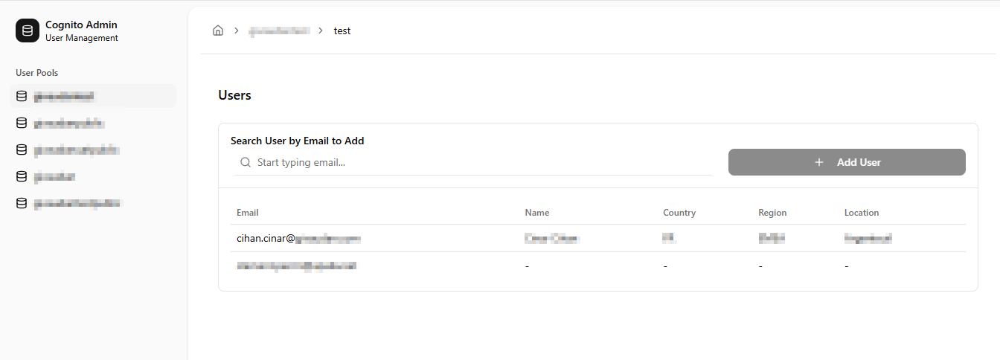

# Cognito Admin App

This project help you to administration cognito pool group users.



## Environment Variables

To run this project, you will need to add the following environment variables to your `.env.local` file in the root directory:

```bash
# .env.local
AWS_REGION=your_aws_region
AWS_ACCESS_KEY_ID=your_aws_access_key_id
AWS_SECRET_ACCESS_KEY=your_aws_secret_access_key
```

Replace the placeholder values with your actual AWS credentials and region. Ensure the IAM user associated with these credentials has the necessary permissions to interact with Cognito (e.g., ListUserPools, ListGroups, ListUsersInGroup, AdminAddUserToGroup, ListUsers).

## Getting Started

First, run the development server:

```bash
npm run dev
```

Open [http://localhost:3000](http://localhost:3000) with your browser to see the result.
